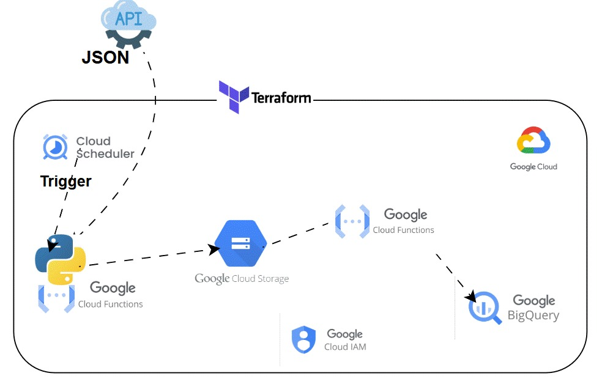

# FEMA-DISASTER-INTERVENTION-DE
A cloud-native serverless ETL pipeline that extracts public JSON data (FEMA), stores raw payloads in Google Cloud Storage, and prepares analytics-ready tables in BigQuery. The repo demonstrates serverless extraction, raw/bronze storage, transformation, and IaC using Terraform.

## Project Overview

This project shows how to build a repeatable serverless pipeline for public-policy and disaster-intervention data. It focuses on reliable ingestion of JSON APIs, safe raw persistence, transformation to analytics-ready rows, and secure, auditable deployments on Google Cloud.

### Data Pipeline Architecture


Public API → Cloud Scheduler → Cloud Run / Cloud Function (`extract_data.py` / `functions/`) → Google Cloud Storage (raw) → Transformation (PySpark / Dataflow) → BigQuery (curated)

## Industry Focus

- Disaster response and humanitarian data
- Government / public policy analytics
- Data engineering for operational reporting and decision support

## Data

Typical fields and metadata captured from the FEMA Public Assistance dataset include:
- award/project identifiers
- recipient and location (state/county/city)
- program and project description
- obligation and award amounts
- project status and activity dates
- derived ingestion metadata (fetched_at, source_url, record_count)

Processed outputs are shaped for analytics and reporting (normalized columns, typed fields, and ingestion metadata).

## Architecture (storage layers)

- Raw (GCS): original JSON payload preserved under date-partitioned paths (`raw/.../YYYY/MM/DD/`)
- Processed (Bronze/Silver): normalized Parquet / staged tables
- Curated (BigQuery): cleaned tables for BI and analytics

## Tools and Technologies

- Google Cloud: Cloud Run / Cloud Functions (2nd gen), Cloud Scheduler, Cloud Storage, BigQuery, Eventarc
- Python (requests, google-cloud-storage), PySpark for transformations
- Terraform for infrastructure as code
- GitHub Actions for CI/CD (recommended)

## Workflow

1. Extract: `extract_data.py` (or the Cloud Function) calls the FEMA API and writes raw JSON into a GCS path.
2. Store: Raw files are stored in a date-partitioned `raw/` prefix in a dedicated bucket.
3. Transform: Run PySpark jobs to flatten and standardise records, writing Parquet to processed folders.
4. Load: Load curated tables into BigQuery for analysis and dashboards.
5. Orchestrate: Use Cloud Scheduler to trigger the extractor; Eventarc / PubSub can trigger downstream transformations if desired.

## What This Project Demonstrates

- Practical serverless ingestion patterns (API → GCS)
- Safe raw storage and metadata capture for reproducibility
- Transform-and-load patterns for BigQuery
- Infrastructure-as-Code with Terraform and repeatable deployments

## Quick start (local)

1. Create and activate a virtual environment:

```bash
python3 -m venv venv
source venv/bin/activate
```

2. Install dependencies for local testing:

```bash
pip install -r requirements.txt
```

3. Run the extractor locally (writes `data.json`):

```bash
python extract_data.py
```

## Cloud deployment (high level)

1. Enable required APIs for your project (Cloud Functions, Cloud Run, Storage, BigQuery, Scheduler, Eventarc).
2. Initialize and apply Terraform in `terraform/`:

```bash
cd terraform
terraform init
terraform plan -out=tfplan
terraform apply tfplan
```

3. Test the scheduled job:

```bash
gcloud scheduler jobs run fema-extractor-schedule --location=${REGION} --project=${PROJECT_ID}
```

## Troubleshooting & Tips

- If Terraform reports `Saved plan is stale`, recreate the plan with `terraform plan -out=tfplan` before applying.
- If uploads are missing, verify the function/service account has `roles/storage.objectCreator` for the bucket.
- Check Cloud Logging for runtime stack traces and Cloud Console for API enablement/billing issues.

## Repository purpose

This repository documents a small, production-aligned approach to ingesting public disaster-intervention data, enabling reproducible deployments and clear operational practices for data engineering in government/NGO contexts.

Contact: open an issue or reach out to the maintainer for help, walkthroughs, or a demo.


